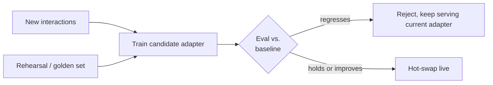

# LLM research, Ahead-of-AI-style

Sebastian Raschka's *Ahead of AI* treats LLM techniques as research ideas with a derivation and a trade-off, not just an API to call. This page applies that treatment to the ideas behind adapting and continually improving a served model.

## LoRA: why fine-tune a low-rank update instead of the weights

**The problem.** Full fine-tuning updates every parameter of a model. For a multi-billion-parameter model that means an optimizer state (Adam keeps two extra tensors per parameter) many times the size of the model itself, and a full-size checkpoint per fine-tuned variant — expensive to store and impossible to switch between at request time.

**The idea.** LoRA (Low-Rank Adaptation) freezes the pretrained weight matrix `W` and learns a much smaller *update* to it, expressed as a product of two skinny matrices: `ΔW = B·A`, where `A` and `B` have a small inner rank `r` (typically 4–64) instead of the full dimensionality of `W`. Effective weight at inference is `W + B·A`. Because `A` and `B` together have far fewer parameters than `W`, the trainable footprint — and the optimizer state riding on it — shrinks by orders of magnitude, and only `A`/`B` need to be checkpointed per fine-tuned variant, not the whole model.

**Why it still works well.** The empirical finding behind LoRA (and the intuition behind it) is that the *update* needed to adapt a pretrained model to a new task tends to have low "intrinsic rank" — you don't need to move the model arbitrarily far through weight space, just along a small number of directions relevant to the new behavior. That's a much weaker requirement than being able to reach *any* point in weight space, which is what full fine-tuning affords.

**The trade-off, and DoRA.** LoRA's constraint is also its limit: some adaptations need more expressive updates than a fixed-rank product can represent, and there's a well-documented gap where LoRA slightly underperforms full fine-tuning on harder tasks. DoRA (Weight-Decomposed Low-Rank Adaptation) narrows that gap by decomposing `W` into magnitude and direction components and applying the low-rank update only to direction, which more closely tracks what full fine-tuning actually does to the weight geometry — at the cost of a slightly more involved decomposition.

**In OmniAI:** `omniai.engine.lora`'s `LoRARegistry` and the hot-swap path in `omniai.engine.engine` exist *because* LoRA adapters are small enough to load, unload, and roll back at request time without restarting the serving process — a full fine-tuned checkpoint couldn't be swapped this cheaply. See [Serving engines § LoRA routing](../concepts/serving_engines.md#lora-routing).

## The continual learning problem: catastrophic forgetting

**The problem.** Train a model further on new data (new interactions, a narrower domain) and it doesn't just gain the new skill — it can lose old ones. Gradient updates driven entirely by the new data can overwrite the weight configuration that encoded prior behavior, a failure mode called *catastrophic forgetting*. This is the central obstacle to any "adapt continuously from live traffic" system: naively, the model your users saw improve on last week's traffic can regress on everything else.

**The mitigation: rehearsal.** Mix a sample of previously-good examples (a "golden" or rehearsal set) into every training batch alongside the new data, so the gradient signal keeps reinforcing old behavior at the same time it learns new behavior. This is the same intuition behind rehearsal-based continual learning methods in the broader literature: forgetting is a data problem as much as an optimization one, and the cheapest fix is to keep showing the model what it shouldn't forget.

**The mitigation: gate before deploy, don't trust the training run.** Even with rehearsal, a training cycle can still produce a worse adapter — bad luck in the sampled batch, a genuine regression on an edge case. The robust pattern is to never let a freshly trained candidate go live unconditionally: evaluate it against a fixed benchmark first, and only promote it if it doesn't regress below baseline. This turns "trust the training pipeline" into "trust the eval gate," which is a much smaller thing to get right.

**In OmniAI:** `omniai.memory.rehearsal`'s `RehearsalBuffer` is the mitigation above, mixed into training by `omniai.memory.learning`'s `ContinuousLearner`; `omniai.evals.gate`'s `AdapterGate` is the shadow-gate — it scores a candidate adapter against a golden dataset before the learner is allowed to hot-swap it in, and a regressing adapter is rejected rather than deployed. See [Compound AI architecture](../COMPOUND_AI.md) for how rehearsal and curation (the noise-filtering step from the [data science page](data_science_dailydose.md#llm-as-a-judge-and-why-it-needs-a-second-model)) combine into one anti-forgetting, anti-poisoning pipeline.

## The eras framing: where continual learning sits in the LLM training stack

A useful way to place all of this: the LLM training stack has grown a sequence of distinct stages, each solving a problem the previous one didn't —

1. **Pre-training** — next-token prediction over broad text, produces general capability.
2. **Supervised fine-tuning (SFT)** — often via LoRA, adapts the base model to follow instructions or fit a narrower behavior cheaply.
3. **RLHF / preference optimization** — aligns outputs with human preference judgments, beyond what next-token SFT alone captures.
4. **RLVR (reinforcement learning from verifiable rewards)** — for tasks with a checkable answer (math, code), trains directly against a verifier instead of a learned reward model.
5. **Continual / online learning** — the model keeps adapting after deployment, from live interaction data, rather than being frozen after a release.

OmniAI's memory/learning subsystem lives entirely in stage 5 — it assumes a model has already been through pre-training and (optionally) SFT/RLHF elsewhere, and its job is to keep adapting a served model safely from live traffic, which is exactly where rehearsal (don't forget stages 1–4) and gating (don't regress against them) become necessary rather than optional.

## Further reading

- [Ahead of AI](https://magazine.sebastianraschka.com/) — the newsletter this page's format is modeled on, for the primary-source depth on LoRA/DoRA mechanics and the current state of LLM training research.
