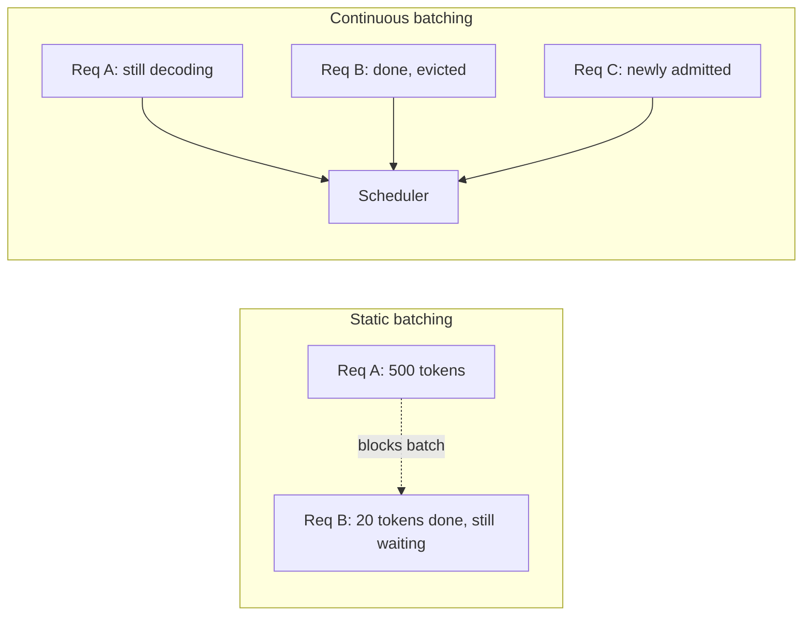
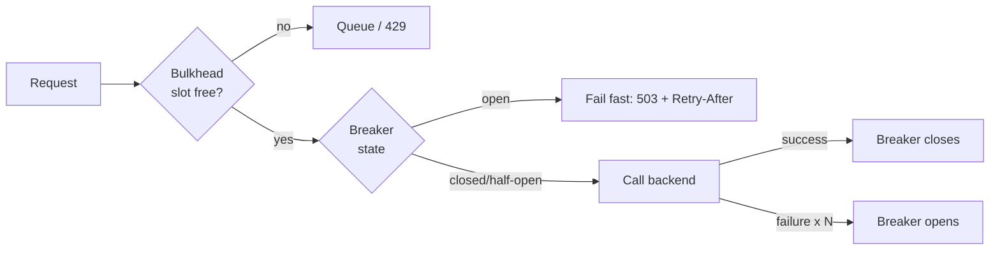
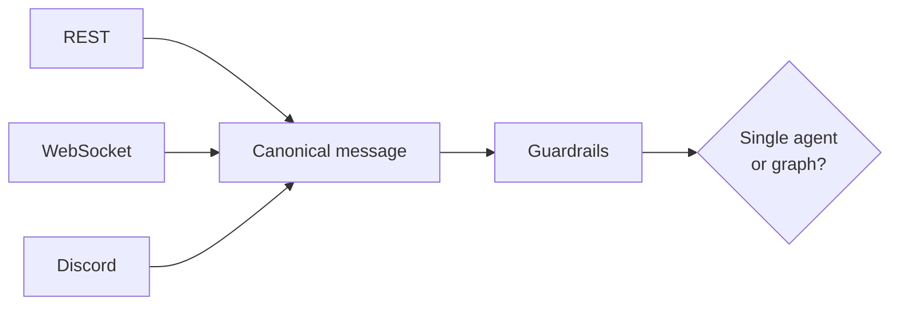

# System design, ByteByteGo-style

ByteByteGo's newsletter teaches distributed systems through diagrams: take a hard production problem, draw the request path, name the pattern. This page applies that format to the three system-design problems that show up when you serve and orchestrate LLMs — using OmniAI's own subsystems as the worked example.

## 1. Continuous batching and paged KV cache

**The problem.** A naive LLM server processes one request at a time, or batches requests that must all finish before the next batch starts — so one slow generation (long output) blocks every request queued behind it. GPU memory is also wasted: a fixed-size buffer must be reserved per request for the worst-case sequence length, even though most sequences are much shorter.

**The pattern.** Two independent ideas, usually bundled together in modern engines (vLLM, SGLang):

- **Continuous (iteration-level) batching** — instead of batching at the request level, the scheduler batches at the *decoding-step* level. A request that finishes early is evicted from the batch immediately and a new one is admitted, so GPU utilization doesn't dip while waiting for the slowest sequence in a static batch.
- **Paged attention** — the KV cache (the growing per-token attention state) is allocated in fixed-size blocks, like OS virtual memory pages, instead of one contiguous reservation per request. This eliminates fragmentation and lets the scheduler admit more concurrent sequences per GB of GPU memory.

**The trade-off.** Continuous batching increases *throughput* (tokens/sec across all users) at the cost of per-request latency jitter — a request's step time now depends on how many other sequences share the batch at that instant. This is why serving layers pair it with admission control (see §2): unbounded admission turns "better throughput" into "everyone's latency degrades together."

**In OmniAI:** this scheduling happens inside the serving backend itself (vLLM/SGLang), not in this codebase — `omniai.engine.backends` treats it as a black box and only maps config (`quantization`, `tensor_parallel_size`, `kv_cache="paged_attention"`) to the right backend flags. What OmniAI *does* own is protecting that scheduler from overload, which is the next pattern.

## 2. Backpressure, retries, and the circuit breaker

**The problem.** A dependency (here, the GPU serving backend) has a hard concurrency ceiling. Naively, a traffic spike either (a) queues unboundedly at the caller until it runs out of memory, or (b) gets forwarded straight to the dependency until *it* falls over — and once it does, every caller retrying immediately turns a brief blip into a sustained outage (a "retry storm").

**The pattern** is three composable wrappers around any call to a flaky, capacity-bounded dependency:

1. **Backpressure (bulkhead)** — a semaphore caps in-flight requests to the dependency. Excess load queues at the edge, where it's cheap to hold, instead of piling onto the GPU process, where over-admission degrades everyone.
2. **Retry with backoff + jitter** — transient failures (connection resets, 5xx) get retried after an exponentially growing, randomized delay. Jitter matters: without it, every caller retries in lockstep and re-creates the exact spike that caused the failure. 4xx responses are the caller's own bug and are never retried.
3. **Circuit breaker** — after N consecutive failures, the breaker "opens": calls fail immediately (fast, cheap 503s) instead of queuing up behind a dependency that's already down. After a cooldown it goes "half-open" and lets through exactly one probe request — if it succeeds the breaker closes, if it fails the cooldown restarts. This stops a recovering server from being stampeded the instant it comes back.

**The trade-off.** Fast-failing during an outage sacrifices a chance that the call *might* have succeeded, in exchange for not making the outage worse. The half-open state trades a little recovery latency (one probe at a time) for safety.

**In OmniAI:** `omniai.engine.resilience` implements exactly this stack in front of every call to the serving backend, and `omniai.gateway.router` maps an open breaker to an HTTP 503 with `Retry-After` rather than letting the caller time out blindly. See [Serving engines](../concepts/serving_engines.md) for the implementation-level walkthrough.

## 3. Gateway fan-in, fan-out, and the single vs. multi-agent question

**The problem.** A product needs to be reachable over REST, WebSockets, and chat platforms (Discord, Slack) without triplicating business logic, and needs to decide, per request, whether one model call is enough or whether the request should be decomposed across specialized agents.

**The pattern — protocol fan-in.** Every channel adapter translates its wire format into one canonical internal message type at the edge, so everything downstream (guardrails, orchestration, logging) is written once against one shape instead of once per channel.

**The pattern — single-agent vs. multi-agent.** A single agent (one model in a tool-call loop) is simpler to reason about, cheaper, and easier to debug — prefer it until a request genuinely needs specialization (a router step handing off to a billing agent vs. a support agent) or parallel sub-tasks that don't share state well in one context window. Multi-agent systems trade that simplicity for composability: each agent has a narrower prompt and toolset, at the cost of coordination overhead (who owns the final answer, how do sub-agent failures propagate, how do you keep them from talking past each other).

**In OmniAI:** `omniai.gateway.router` and `omniai.gateway.adapters` do the fan-in described above (see [Gateway](../concepts/gateway.md)). The single-vs-multi-agent choice maps directly onto `omniai.graph`: a single `create_tool_agent` is the model⇄tools loop (see [Agents](../concepts/agents.md)); composing multiple nodes into a `Graph` with conditional edges (see [Graphs](../concepts/graphs.md)) is the multi-agent form — the same state machine, just with more nodes.

## Further reading

- [ByteByteGo Newsletter](https://blog.bytebytego.com/) — the newsletter this page's format is modeled on; see its archive for deep dives on load balancing, message queues, and (increasingly) GenAI system design.
